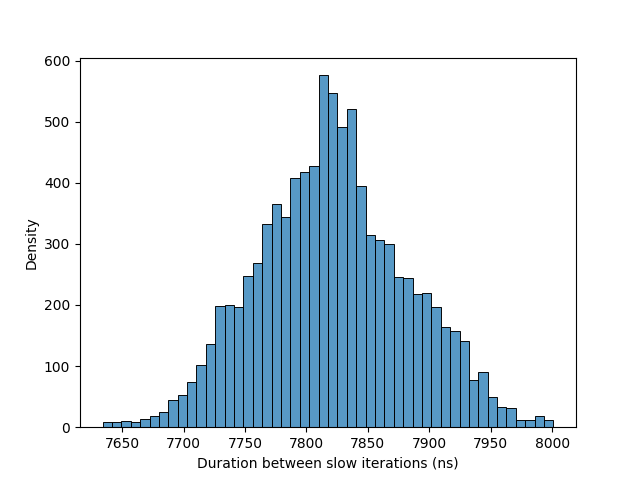

# Labo perf

## Informations du cache 
```
getconf -a | grep CACHE
```

**Combien de niveaux de cache avez-vous sur votre ordinateur ?**
3 Niveaux de cache.

**Quelle est la taille d'une ligne de cache en bytes ?**
64 bytes.

**Quels sont les tailles des caches pour chaque niveau en KiB ?**
- L1: 32 KiB
- L2: 256 KiB
- L3: 12288 KiB - 12 MiB

## Expérience n°1 : Prédiction d'embranchements
```
❯ perf stat -e branches,branch-misses ./branch-misprediction 0
1579

 Performance counter stats for './branch-misprediction 0':

       881’968’231      branches:u                                                            
       209’753’725      branch-misses:u                                                       

       1.841100750 seconds time elapsed

       1.702279000 seconds user
       0.128290000 seconds sys


labo-pco-performance-hadrien-fuentes on  master [?] via 🐍 v3.14.3 took 2s 
❯ perf stat -e branches,branch-misses ./branch-misprediction 1
396

 Performance counter stats for './branch-misprediction 1':

     1’794’399’828      branches:u                                                            
        38’461’925      branch-misses:u                                                       

       1.243561675 seconds time elapsed

       1.121058000 seconds user
       0.116421000 seconds sys
```

**Quelle est la différence entre les deux exécutions ?**
L'exécution avec l'argument 0 a beaucoup plus de branch-misses que celle avec l'argument 1 alors qu'il y plus de branches. Cela suggère que le code avec l'argument 0 a une logique de branchement plus complexe ou moins prévisible, ce qui entraîne plus de mispredictions. Le programme prend également plus de temps à s'exécuter.

**Pouvez-vous expliquer pourquoi ?**
Le programme compare le contenu de chaque cases d'un tableau à une vleur fixe, si le programme est lancé avec l'argument 0, les valeurs du tableau sont aléatoires, ce qui rend les branches plus difficiles à prédire. En revanche, si le programme est lancé avec l'argument 1, les valeurs du tableau sont triées, ce qui rend les branches plus prévisibles et réduit le nombre de mispredictions.

**Reportez le ratio branch-misses / branches pour les deux exécutions.**
- Avec l'argument 0: 209’753’725 / 881’968’231 ≈ 0.2379 (23.79%)
- Avec l'argument 1: 38’461’925 / 1’794’399’828 ≈ 0.0214 (2.14%)

**Que pensez-vous de la question StackOverflow [Why is it faster to process a sorted array than an unsorted array?](https://stackoverflow.com/questions/11227809/why-is-it-faster-to-process-a-sorted-array-than-an-unsorted-array) et du nombre de upvotes ?**

## Expérience n°2 : Latences de la SDRAM
**Que constatez-vous ?**
Le temps de latence moyen est de 7.8uS

**Comment expliquez-vous ces résultats ?**

**Trouvez-vous une correspondance de vos résultats ici (https://fr.wikipedia.org/wiki/Rafra%C3%AEchissement_de_la_m%C3%A9moire) ?**
```
intervalle = temps maximal entre les rafraichissements \ nombre de rangées à rafraichir

Par exemple, la génération actuelle (2012) de puces DDR SDRAM a un temps maximal entre les rafraîchissements de 64 ms et 8192 lignes. L'intervalle entre les courtes séries de cycles de rafraîchissement est donc de 7,8 μs.
```


## Expérience n°3 : False Sharing
```
 Performance counter stats for './false-sharing 3 1':

                 0      context-switches:u               #      0.0 cs/sec  cs_per_second     
                 0      cpu-migrations:u                 #      0.0 migrations/sec  migrations_per_second
               148      page-faults:u                    #    549.2 faults/sec  page_faults_per_second
            269.48 msec task-clock:u                     #      2.4 CPUs  CPUs_utilized       
             2’855      L1-dcache-load-misses:u          #     26.5 %  l1d_miss_rate            (38.34%)
             1’423      LLC-loads:u                      #     33.5 %  llc_miss_rate            (25.58%)
            14’008      branch-misses:u                  #      0.0 %  branch_miss_rate         (25.53%)
       194’464’044      branches:u                       #    721.6 M/sec  branch_frequency     (25.60%)
       203’626’444      cpu-cycles:u                     #      0.8 GHz  cycles_frequency       (37.74%)
       595’887’473      instructions:u                   #      2.9 instructions  insn_per_cycle  (37.27%)

       0.098376481 seconds time elapsed

       0.258325000 seconds user
       0.006850000 seconds sys
```
``` 
 Performance counter stats for './false-sharing 3 8':

                 0      context-switches:u               #      0.0 cs/sec  cs_per_second     
                 0      cpu-migrations:u                 #      0.0 migrations/sec  migrations_per_second
               149      page-faults:u                    #    577.7 faults/sec  page_faults_per_second
            257.94 msec task-clock:u                     #      2.7 CPUs  CPUs_utilized       
             2’428      L1-dcache-load-misses:u          #     11.3 %  l1d_miss_rate            (38.18%)
             6’512      LLC-loads:u                      #     35.3 %  llc_miss_rate            (24.94%)
            27’755      branch-misses:u                  #      0.0 %  branch_miss_rate         (24.82%)
       195’125’957      branches:u                       #    756.5 M/sec  branch_frequency     (24.89%)
       196’252’424      cpu-cycles:u                     #      0.8 GHz  cycles_frequency       (38.50%)
       582’710’462      instructions:u                   #      2.9 instructions  insn_per_cycle  (38.84%)

       0.092926403 seconds time elapsed

       0.247220000 seconds user
       0.006902000 seconds sys
```
**Que constatez-vous ?**

**Comment expliquez-vous ces résultats ?**

**Quel est le comportement en faisant varier les différents paramètres (nombre de threads, valeurs intermédiaires d'increment entre 1 et 8) ?**
```
labo-pco-performance-hadrien-fuentes on  master [?] is 📦 v0.1.0 via 🐍 v3.14.3 
❯ perf stat -d ./false-sharing 12 1
perf stat -d ./false-sharing 12 8
39

 Performance counter stats for './false-sharing 12 1':

                 0      context-switches:u               #      0.0 cs/sec  cs_per_second     
                 0      cpu-migrations:u                 #      0.0 migrations/sec  migrations_per_second
               165      page-faults:u                    #    404.2 faults/sec  page_faults_per_second
            408.18 msec task-clock:u                     #      8.1 CPUs  CPUs_utilized       
            51’850      L1-dcache-load-misses:u          #      4.6 %  l1d_miss_rate            (37.68%)
            36’207      LLC-loads:u                      #     23.2 %  llc_miss_rate            (25.90%)
            23’059      branch-misses:u                  #      0.0 %  branch_miss_rate         (28.01%)
       814’928’882      branches:u                       #   1996.5 M/sec  branch_frequency     (28.67%)
     1’605’971’741      cpu-cycles:u                     #      3.9 GHz  cycles_frequency       (40.44%)
     2’428’578’674      instructions:u                   #      1.5 instructions  insn_per_cycle  (37.44%)

       0.041198934 seconds time elapsed

       0.404996000 seconds user
       0.000994000 seconds sys


36

 Performance counter stats for './false-sharing 12 8':

                 0      context-switches:u               #      0.0 cs/sec  cs_per_second     
                 0      cpu-migrations:u                 #      0.0 migrations/sec  migrations_per_second
               169      page-faults:u                    #    414.8 faults/sec  page_faults_per_second
            407.40 msec task-clock:u                     #     10.6 CPUs  CPUs_utilized       
            14’745      L1-dcache-load-misses:u          #      6.1 %  l1d_miss_rate            (37.29%)
            39’592      LLC-loads:u                      #     29.9 %  llc_miss_rate            (25.75%)
            40’955      branch-misses:u                  #      0.0 %  branch_miss_rate         (27.96%)
       808’245’139      branches:u                       #   1983.9 M/sec  branch_frequency     (28.55%)
     1’597’288’822      cpu-cycles:u                     #      3.9 GHz  cycles_frequency       (40.57%)
     2’438’371’896      instructions:u                   #      1.5 instructions  insn_per_cycle  (37.67%)

       0.037771432 seconds time elapsed

       0.404017000 seconds user
       0.000991000 seconds sys
```

## Expérience n°4 : Cache locality
N = 10'000
```
❯ perf stat -e cache-references,cache-misses ./locality-line
perf stat -e cache-references,cache-misses ./locality-col
Parcours par ligne (row-major) : 4999999950000000
Temps d'acces: 0.0251668 s

 Performance counter stats for './locality-line':

        26’876’301      cache-references:u                                                    
        16’896’409      cache-misses:u                                                        

       0.233680347 seconds time elapsed

       0.094653000 seconds user
       0.138533000 seconds sys


Parcours par colonne (column-major) : 4999999950000000
Temps d'acces: 0.0246336 s

 Performance counter stats for './locality-col':

        26’860’929      cache-references:u                                                    
        16’838’295      cache-misses:u                                                        

       0.230751496 seconds time elapsed

       0.101592000 seconds user
       0.128645000 seconds sys


``` 

N = 2000
```
❯ perf stat -e cache-references,cache-misses ./locality-line
perf stat -e cache-references,cache-misses ./locality-col
Parcours par ligne (row-major) : 7999998000000
Temps d'acces: 0.00124691 s

 Performance counter stats for './locality-line':

         1’136’201      cache-references:u                                                    
           690’130      cache-misses:u                                                        

       0.011488082 seconds time elapsed

       0.004160000 seconds user
       0.007288000 seconds sys


Parcours par colonne (column-major) : 7999998000000
Temps d'acces: 0.00120193 s

 Performance counter stats for './locality-col':

         1’157’884      cache-references:u                                                    
           708’307      cache-misses:u                                                        

       0.011615888 seconds time elapsed

       0.004788000 seconds user
       0.006636000 seconds sys
```

**Que fait le programme ?**

**Quelle est la différence entre les deux exécutions ?**

**Comment expliquez-vous ces résultats ?**